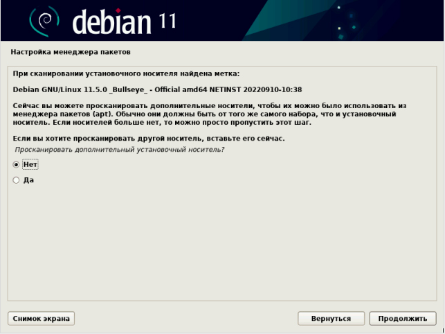
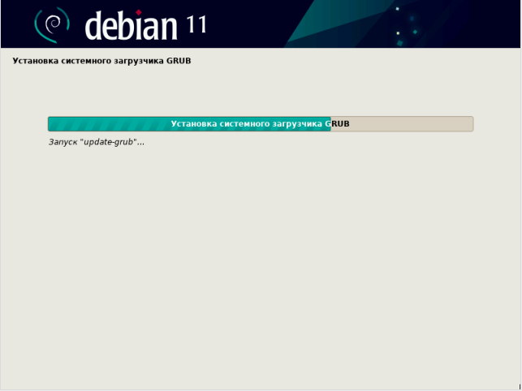

## Инструкция по установке ОС Linux

В качестве операционной системы (ОС) в АПК «СРТА-Регистратор»
используется ОС типа Linux, дистрибутив Debian 11 с версией ядра
5.10.0-21-amd64.

Для установки используется заранее подготовленный флэш накопитель с
записанным установочным дистрибутивом ОС. Аппаратная часть АПК
(bios/uefi) должна быть настроена на автоматический запуск установщика
ОС при включении оборудования.

Далее, будут представлены основные шаги по установке, со скриншотами
экранов и комментариями там, где это будет необходимо.

1\.  Стартовый экран загрузчика. Рассмотрим вариант установки “Graphical
    Install”.

2\.  Выбор языка.

3\. Выбор местоположения, указываем Российская Федерация.

4\. Настройки клавиатуры. Выбор раскладки (языка).

5\. Настройки клавиатуры. Настройки комбинаций клавиш переключения.

6\. Далее идет загрузка компонентов системы.

7\. Настройка сети. Выбор основного сетевого интерфейса.

8\. Настройки сети. Указываем имя компьютера в сети.

9\. Настройка сети. Предлагается указать имя домена. Можем указать
позднее, пропускам.

10\. Настройки учетных записей и паролей. Указываем пароль
суперпользователя.

11\. Настройки сети. Имя нового пользователя системы.

12\. Название учетной записи нового пользователя. Имя пользователя
“apk_user”

13\. Настройка пароля для пользователя системы.

14\. Выбор настройки системного времени в АПК.

15\. Разметка дисков. Указан автоматический вариант. Возможны другие
настройки.

16\. Разметка дисков.

17\. Разметка дисков. Возможны другие варианты.

18\. Завершение разметки дисков.

19\. Подготовка форматирования дисков.

20\. Установка базовой системы.

21\. Настройка менеджера пакетов.

22\. Настройка менеджера пакетов. Выбор региона Российская Федерация.

23\. Настройка менеджера пакетов. Указание архивов.

24\. Указание российского зеркала данных.

25\. Настройка менеджера пакетов. Указание прокси сервера, если
необходимо.

26\. Настройка менеджера пакетов.

27\. Установка.

28\. Отключаем сбор статистики для разработчика дистрибутивов ОС.

29\. Установка.

30\. Выбор компонентов программного обеспечения. Устанавливаем только
основные утилиты и SSH.

31\. Установка выбранных программных модулей ОС.

32\. Установка системного загрузчика GRUB.

33\. Указываем куда устанавливать GRUB.

34\. Установка системного загрузчика GRUB.

35\. Завершение установки ОС Debian 11.

36\. Установка завершена. Перезагрузить систему.

37\.

38\. Авторизация в системе. Проверка работоспособности.

39\. Проверка установленных и настроенных автоматически сетевых
устройств АПК.

40\. Смена IP адреса на необходимый проводится редактированием файла
/etc/network/interfaces

